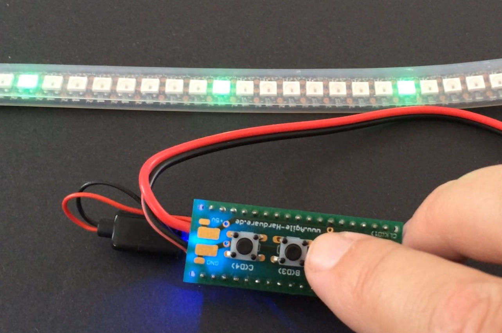
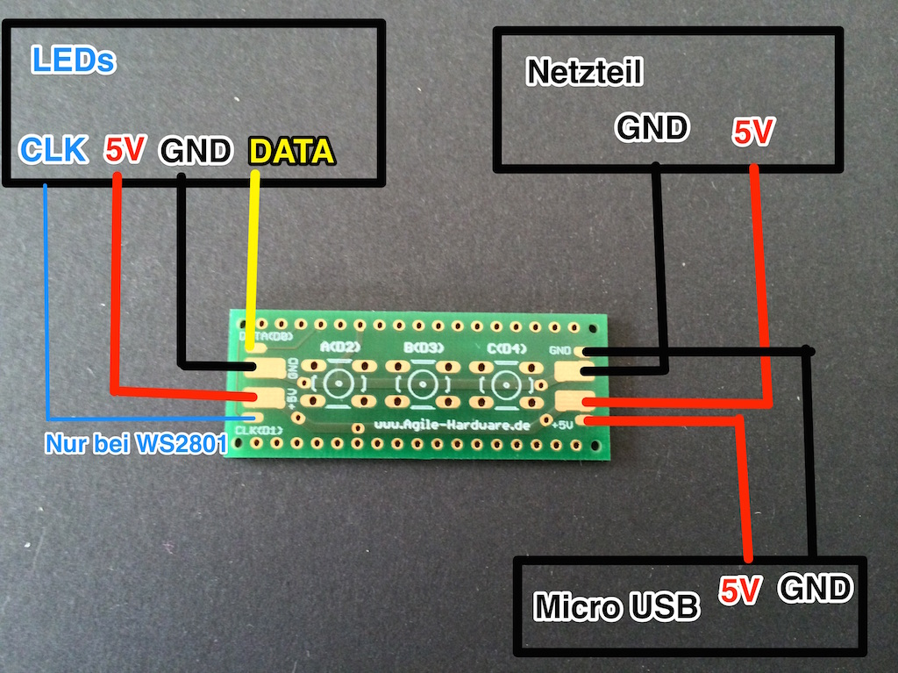
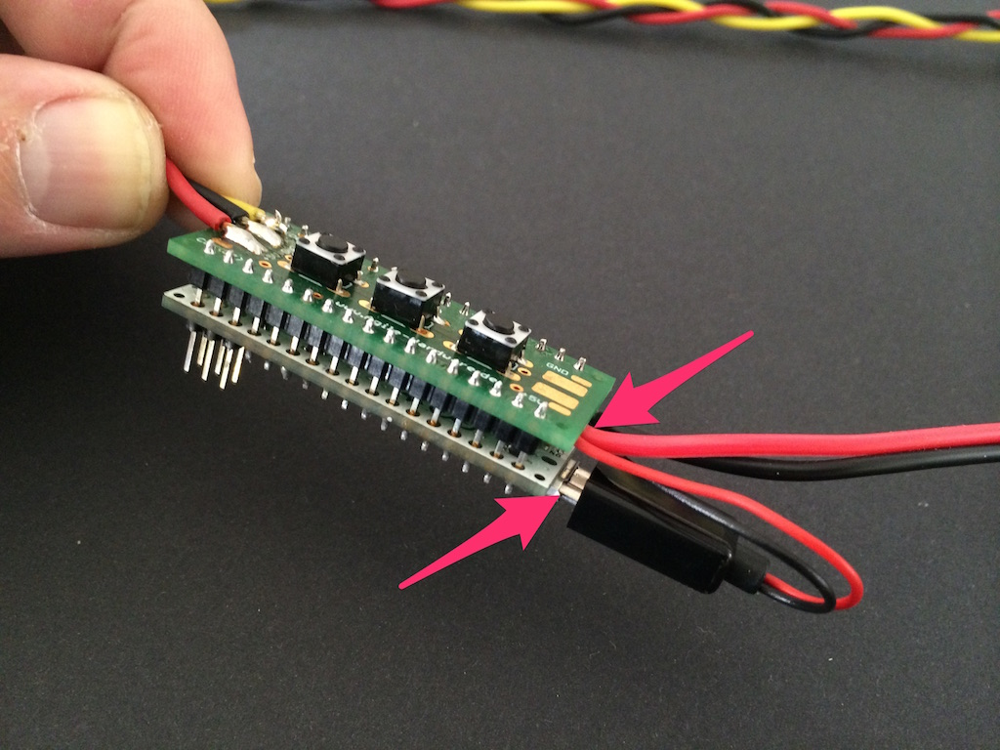
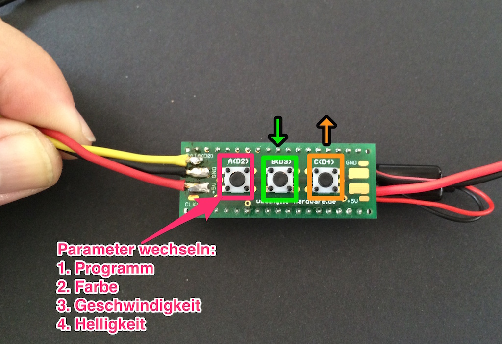
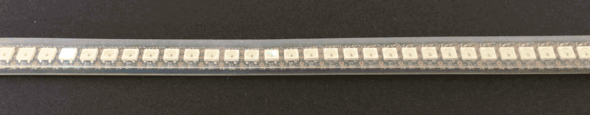

## WS28xx Micro Adapter

LED Streifen mit WS2801/11 Steuerungschips ermöglichen das einzelne Ansteuern der Farbe jeder einzelnen LED. Dadurch ist es möglich vielfältige und hübsche Animationen zu gestalten.

Das macht sehr viel Spaß, das Betreiben dieser Streifen ist aber leider nicht ganz einfach. Außerdem braucht man noch ein zusätzliches Interface wenn man zum Beispiel zwischen verschiedenen Animationen wählen möchte.

Wir haben dafür eine einfache Lösung, natürlich basierend auf Arduino. Mit unserem WS28xx Micro Adapter und einem Arduino Micro ist es ganz einfach, verschiedene Animationen abzuspielen, Parameter wie Helligkeit und Farbe zu ändern und eigene Animationen hinzuzufügen. Die Steuerung funktioniert ganz einfach über Tasten, die wie bei einer Stehlampe direkt am Stromkabel zu finden sind.

Der WS28xx Micro Adapter ist als Shield für den Arduino Micro konzipiert. Er kann also einfach aufgesteckt werden. Das Board verfügt über 3 Tasten zur Steuerung und den nötigen Pads um den LED Strip und eine Stromversorgung anzuschließen.

Außerdem haben wir [die passende Software](https://www.github.com/AgileHardware/WS28xxMicroAdapter) dazu entwickelt um mit vielen vorprogrammierten Animationen gleich loszulegen und schnell eigene Animationen zu programmieren.

Wir verkaufen [ein unbestücktes PCB](http://my.agile-hardware.de/de/ws28xx-micro-adapter-nur-pcb) oder ein [Kit inklusive Arduino Micro](http://my.agile-hardware.de/de/ws28xx-micro-adapter-kit). Wenn du das Kit gekauft hast, kannst du es mit folgender Anleitung zusammenbauen:

### Benötigte Teile

- [WS28xx Micro Adapter Kit](http://my.agile-hardware.de/de/ws28xx-micro-adapter-kit) 
- 5V Netzteil mit GND und VCC Kabeln die auf die Pads gelötet werden können.
- Kompatibler LED Streifen, z.B. Adafruit Neopixel Produkte. [Kompatible Produkte in unserem Shop](http://my.agile-hardware.de/de/search?page=search&page_action=query&desc=on&sdesc=on&keywords=ws8xx)

### Aufbau

1. Löte ein 5V und ein GND Kabel an den Micro-USB Stecker.

2. Löte die 3 Kabel des LED Strips, die zwei Kabel der Stromversorgung und die zwei Kabel des Micro USB Anschlusses an die entsprechenden Pads.

3. Löte die 3 Buttons auf das Board.

4. Löte die beiden 17 Pin Header in die Löcherleisten auf den beiden Seiten des ws28xxreplace.

5. Stecke den WS28xx Micro Adapter auf den Arduino Micro. Die Stromversorgung des Adapters muss auf der gleichen Seite liegen wie der Micro-USB Anschluss des Arduino Micro. Löte dann alle Pins an der Unterseite an den Arduino.

6. Stecke das kleine Micro USB Kabel vom WS28xx Micro Adapter in dem Arduino Micro.

7. Fertig. Stecke das Netzteil in die Steckdose um deine LEDs einzuschalten.

### Steuerung

Der LED Streifen kann über die 3 Buttons auf dem WS28xx Micro Adapter gesteuert werden. Mit dem ersten Button `A(02)` wählst du aus welchen Parameter du verändern möchtest und mit den anderen beiden kannst du den Wert nach oben `C(04)` und unten `B(03)` setzen. Die Parameter sind:

1. Programm
2. Farbe
3. Geschwindigkeit
4. Helligkeit

Der Status der verschiedenen Werte wird während der Steuerung am Anfang des LED Streifens angezeigt.

### Software aufspielen

Unsere Software für den WS28xx Micro Adapter kannst du [hier auf github](https://www.github.com/AgileHardware/WS28xxMicroAdapter) herunterladen. Wähle die Option "Download ZIP" und kopiere den entpackten Ordner in dein Arduino Sketchbook Verzeichnis. Außerdem musst du noch die [Adafruit NeoPixel Bibliothek](https://github.com/adafruit/Adafruit_NeoPixel) [installieren](http://arduino.cc/en/Reference/Libraries).
Nun kannst du das Projekt über dein Arduino IDE öffnen und auf deinen Arduino spielen. Verbinde dazu deinen Computer mit einem Micro USB Kabel mit dem Arduino Micro und vergiss nicht unter "Tools > Board" Arduino Micro auszuwählen.

### Eigene Animationen

Du kannst ganz einfach deine eigenen Animationen programmieren. Öffne dazu [das Projekt von github](https://www.github.com/AgileHardware/WS28xxMicroAdapter) in deinem Arduino IDE. 

Alle Animationen sind in der Datei [`animations.cpp`](https://www.github.com/AgileHardware/WS28xxMicroAdapter/blob/master/animations.cpp) definiert. Das Grundprinzip einer Animationen ist an `yourAnimation` gut zu erkennen. Wenn du deine erste eigene Animation schreiben willst kopiere am besten diese Funktion als Ausgangsbasis, oder bearbeite sie einfach.

	uint16_t yourAnimation(uint16_t tick, uint32_t color) {
		for (uint16_t i = 0; i<NUM_LEDS; i++) {
			if(i == tick) {
				setLedColor(i, color);
			} else {
				setLedColor(i, BLACK);
			}
		}
		return NUM_LEDS;
	}

Der Wert `tick` steuert der den Ablauf der Animation.
Jede Animationsfunktion gibt in ihrem Rückgabewert an, wie viele Schritte die Animation hat. Die Funktion wird dann zu jedem Schritt mit einem erhöhten Wert für `tick` aufgerufen, bis die volle Schrittzahl erreicht ist. Dann beginnt `tick` wieder bei 0.

Aus dem aktuellen Wert von `tick` muss die Animationsfunktion dann das aktuelle Bild errechnen. Verschiedene Wege dafür werden in den vielen Beispielanimationen aufgezeigt. Die Möglichkeiten reichen von einfach (z.B. `snake1`) bis komplex (z.B. `rainbowColors`).

Es ist wichtig das die Funktion für einen gleichen `tick` Wert ein gleiches Ergebnis liefert, damit die Geschwindigkeit der Animation vom Benutzer geregelt werden kann. Sofern möglich, sollte in der Animation die Farbe die im Wert `color` übergeben wird verwendet werden.

Wenn du nun in [`animations.cpp`](https://www.github.com/AgileHardware/WS28xxMicroAdapter/blob/master/animations.cpp) eine neue Animation hinzugefügt hast, musst du sie nur noch in [`animations.h`](https://www.github.com/AgileHardware/WS28xxMicroAdapter/blob/master/animations.h) und [`WS28xxMicroAdapter.ino`](https://www.github.com/AgileHardware/WS28xxMicroAdapter/blob/master/WS28xxMicroAdapter.ino) mit in die Listen aufnehmen damit sie mit den Tasten ausgewählt werden kann. Außerdem muss die Anzahl aller Animation im Wert NUM_PROGRAMS in der Datei "constants.h" erhöht werden.
Wie das geht, kannst du im Code anhand der auskommentierten Zeilen für `yourAnimation` sehen.

Viel Spaß
